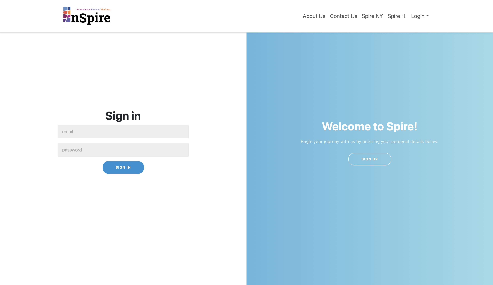
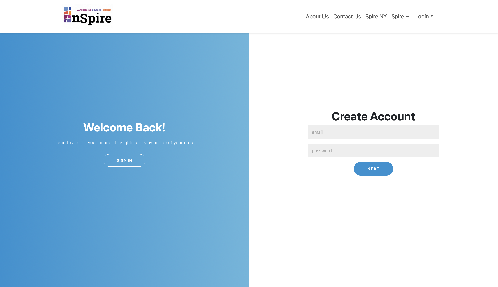

  

## I. Introduction:
---
This semester in ICS 414 has been an invaluable learning experience, particularly as we worked on a real-world project for the company Inspire. The project revolved around developing a Financial Sustainability Platform (FSM), which provided an opportunity to engage deeply with financial modeling and software development processes. Our overarching goal was to transition Inspire’s existing financial models into a more integrated, user-friendly platform, emphasizing accuracy, usability, and automation. This class has provided me with hands-on experience that mirrors real-world software development, making it one of the most practical courses in my academic journey.

## II. Milestones and Collaboration:
---
The course was structured around milestones that helped us break the project into smaller, actionable tasks. These milestones allowed us to focus on key aspects such as understanding the financial model, improving the user interface, and ensuring the backend functionality met the client’s needs. Each milestone was accompanied by presentations, where we showcased our progress to both the instructor and our client.

These client presentations were critical, as they not only kept us accountable but also allowed us to receive direct feedback. This feedback guided our development priorities and helped us align with the client’s vision. It was during these presentations that I learned how to ask meaningful questions to better understand the client’s pain points and how to adapt our software accordingly.

## III. Sign-In and Sign-Up Page Development:
---
A major feature I worked on during this project was the Sign-In and Sign-Up pages, which are essential for ensuring user access and security. This component required me to focus on both front-end and back-end functionality. Implementing user authentication taught me how to prioritize user experience while maintaining secure practices, such as password validation and error handling.

From designing user-friendly forms to handling edge cases like duplicate accounts and weak passwords, this task challenged me to think critically about software usability. Additionally, testing these features using tools like TestCafe allowed me to adopt a systematic approach to quality assurance. This experience reinforced the importance of thorough testing and iterative improvement to deliver reliable and polished features.

  
  

                                             

  (open image in new tab to enlarge)

## IV. Code Reviews and Iterative Development:
---
A significant component of ICS 414 was code reviews, a practice that helped improve both individual and team-based coding standards. Each week, we would review our own contributions on GitHub and leave comments highlighting areas for improvement. This process emphasized the importance of clean, maintainable code and ensured that all team members understood the changes being made to the project.

These reviews taught me how to approach my own code critically, looking for potential bugs, inefficiencies, or places where the logic could be streamlined. They also strengthened my ability to collaborate with team members, as we had to understand and integrate feedback constructively.

## V. Key Takeaways:
***
- <b>Client Communication:</b> Regular interaction with our client taught me how to present technical information in a way that is accessible and actionable.

* <b>Code Quality:</b> Weekly code reviews reinforced the importance of clean, readable, and efficient code.

- <b>Real-World Application:</b> Working on the FSM for Inspire gave me insight into how software can solve real business problems.

* <b>Collaboration:</b> Teamwork was a central aspect of the project, and I learned how to leverage team members’ strengths to achieve our goals.

## VI. Real-Life Job Simulations:
___
This course stood out because it closely simulated working in a real-life tech job. From collaborating with clients to understanding their requirements, I gained a clear understanding of the development lifecycle. Weekly progress check-ins, client presentations, and the ability to handle feedback prepared me for the dynamic and fast-paced nature of the tech industry. Tasks like writing detailed documentation and adhering to a consistent coding standard further reinforced this connection to industry practices.

## VII.  Challenges, Teamwork, and Growth:
___
One of the most significant lessons from ICS 414 was the importance of teamwork. While working with a team allowed us to leverage each other's strengths, it also presented challenges, such as coordinating schedules, resolving conflicts, and managing different coding styles. Despite these difficulties, I learned how to communicate effectively, delegate tasks appropriately, and support my team members to ensure the project's success.

Balancing the project's technical aspects—such as implementing dynamic data inputs and ensuring accurate calculations—with usability improvements, like UI design, pushed me to grow as a full-stack developer. Financial models are inherently complex, and translating them into software required a strong understanding of both financial concepts and programming logic. The challenges I faced during this process significantly contributed to my growth.

## VII.  Conclusion:
ICS 414 has been one of the most practical courses in my academic journey. It bridged the gap between classroom concepts and real-world application, providing me with valuable experience in agile development, client interaction, and financial modeling. By participating in this project, I now feel more confident in my ability to contribute meaningfully to complex software solutions and collaborate effectively within a team. This experience has prepared me for the challenges of working in the tech industry, equipping me with skills that I will carry forward into my career.
