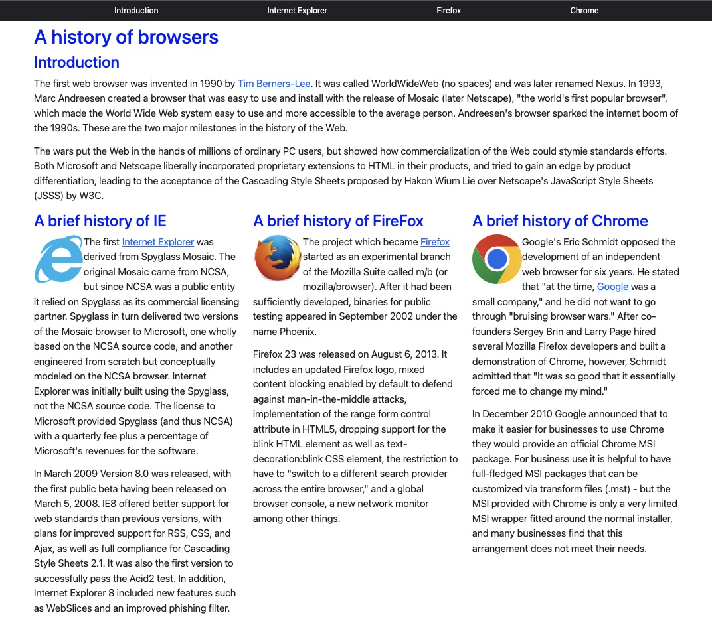
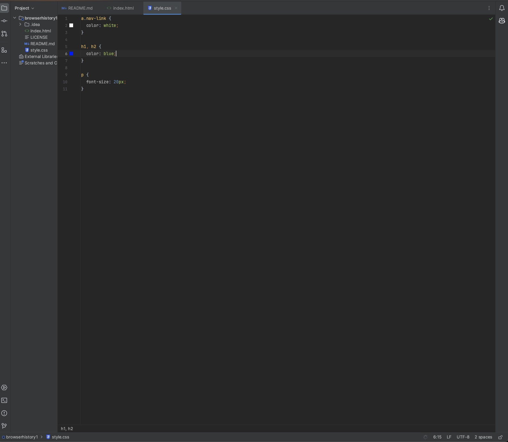
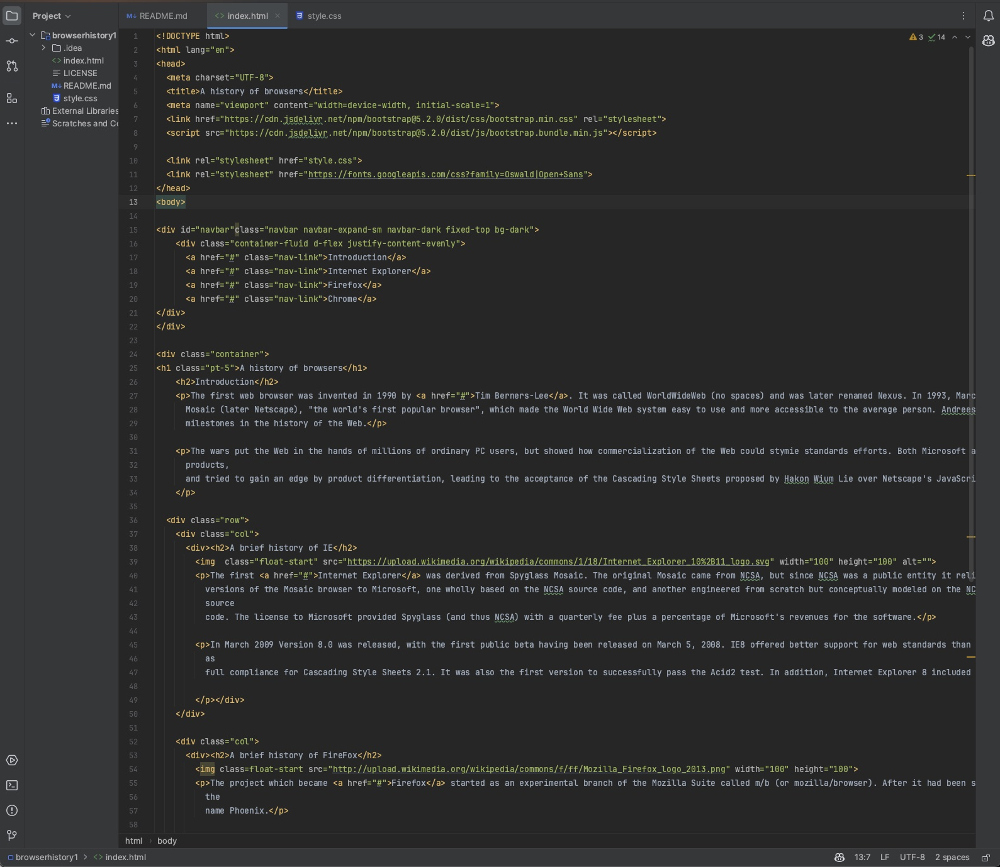
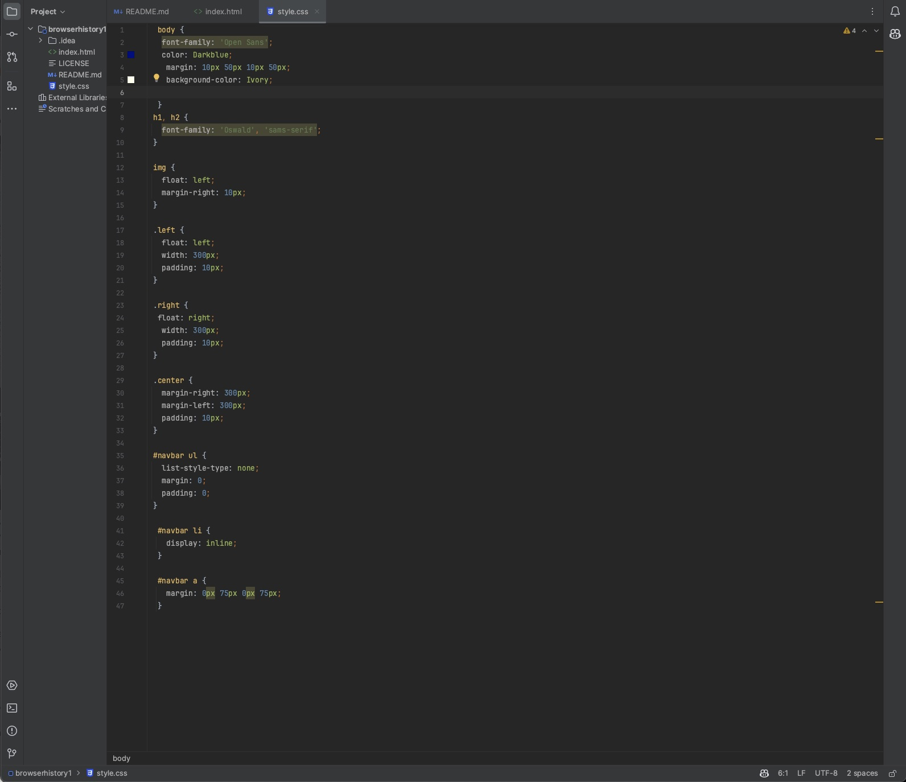
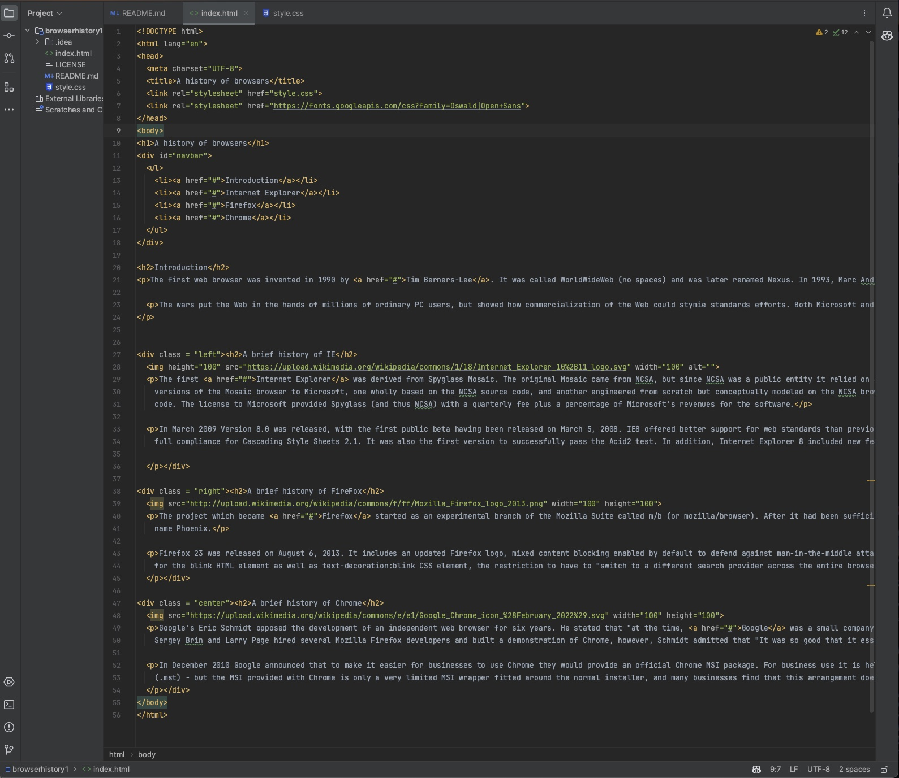

  

## Importance of Learning UI frameworks
In the world of website digitalization where the web page can make or break an individual or overall organization at first glance. The design and user experiecne of creating a web application plays a really big role. While being able to use HTML and CSS can offer the basic building blocks to compiling a website, The use of UI frameworks like BootStrap 5, provides a level of efficiency and sophistication that would be hard to achieve manually. But, why spend the extra time learning this? Why indulge in the intricacies of a UI Framework?

  
  
  
    

                                             
                                                  (open image in new tab to enlarge)

  (open image in new tab to enlarge)

## Why UI Frameworks?
For the most part UI frameworks might seem intimidating, But in my opinion, the long-term rewards overweigh the time spent learning it. The personal experience I have shared resonates with many other beginner developers going through the same process. Just as a construction worker wouldn't build a skyscraper brick by brick, a developer benefits from having structured and already defined blueprints at there disposal to format the website.

## Pros of learning a UI Framework
Frameworks provide a consistent set of components to use making sure the unified look and feel across the entire webpage is how you truly want it. With the variety of numerous types of UI. Bootstrap 5 for example shines the most with its mobile-first approach. This guarantees that the application will look good for all different kinds of device sizes without the additional tweaks from the user.
Imagine recreating buttons, navbars or any type of modern function to a new site using your basic “HTML” and “CSS”. WIth UI frameworks like Bootstrap, these components are readily available, saving all those hours of development time which is very crucial. The comparison image provided is a really great example of this. The main difference between the code for building the webpage with and without a framework is evident.
Besides that frameworks like BootStrap are highly customizable. Many developers have the liberty to override default styles, ensuring they get their own unique style that they pictured in their head and on the website.

## Are there any Downsides?
With my personal experience, there are absolutely no downsides in my opinion considering some small issues:

- <b>Learning Curve:</b> As i mentioned earlier, the overall learning gap is quite steep and stressful to learn, especially for first time learners. The initial grasp of the framework’s classes, functions and structure can be scary at first. But like all new things the first few steps are always hard but it is an investment, once mastered, offering returns outlooking the trails spent learning it.

* <b>Performance:</b> Using a full framework carelessly can result in bulky websites. The full framework may frequently be incorporated by many developers, which causes slower page loads. Adopting a good strategy and including only the necessary components is essential.

- <b>Uniformity:</b> If designers don't stray from the preset styles, websites run the risk of being overly identical. When a popular framework is used frequently, websites might start to look unauthentic and seem repetitive. Overall make sure to stir away from using other websites as examples, try to create something on the top of your dome first.

* <b>Over-reliance:</b> Although frameworks have many advantages, relying on them excessively can hinder a developer's fundamental comprehension of basic web concepts. It's critical to strike a balance and avoid relying solely on the framework for work.

## Overview
While the use of raw HTML and CSS give you the basic control and understanding of web styling, UI frameworks such as Bootstrap, streamline the process, offering  structured, efficient, and a more consistent approach to overall web design. Their ever growing communities, limitless amount of features, and emphasis on responsive design make them a mandatory tool for a developer. After all, in a world that's moving way too fast in tech, anything that helps in achieving results faster, without compromising on quality, is a necessity.

