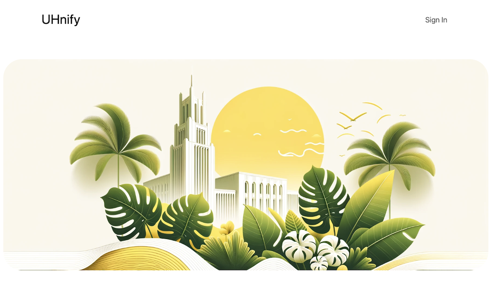
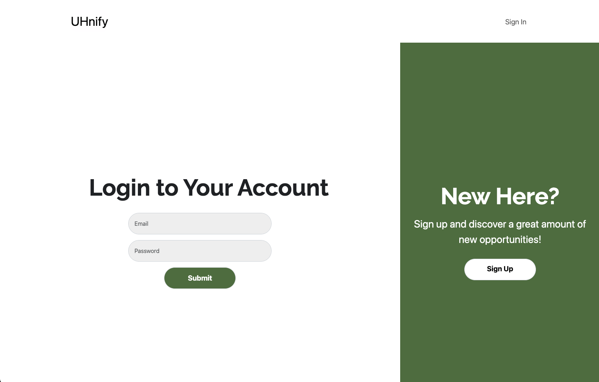
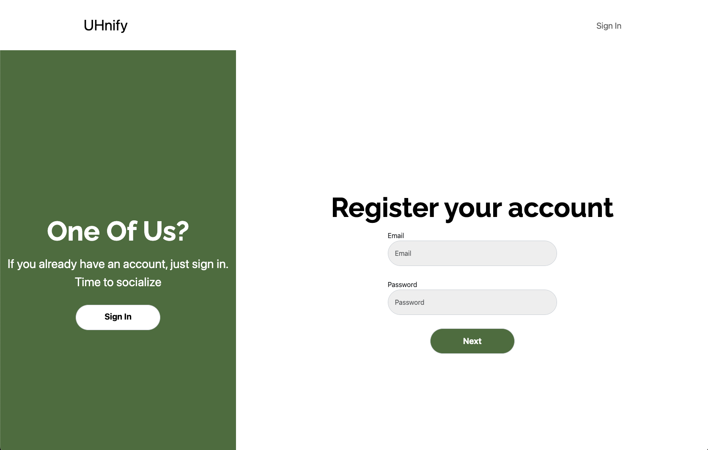
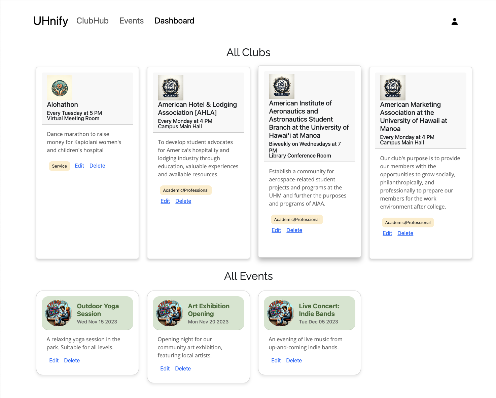

## Description:
---
UHnify is a collaborative project that my team and I developed to connect University of Hawaii at Manoa students with various student clubs. Our platform allows users to create an account, join clubs, and gain access to club specific events and activities, enhancing their campus experience. For a more comprehensive look, please visit our [GitHub HomePage](https://uhnify.github.io/).

## Contribution:
---
#### SignIn/SignUp Page
For the SignIn/SignUp page, I developed a user friendly interface, focusing on a specific design for easy navigation between signing in and signing up processes. My design choices were geared towards creating a welcoming and straightforward experience, encouraging user engagement right from their first interaction with the platform. This included formulating the layout, choosing color schemes, and ensuring that the transition between signing in and creating an account was as smooth as possible. I also played a pivotal role in coding the backend functionality that supports these pages in collaboration with a team member.

  
  

  (open image in new tab to enlarge)

#### Footer 
I was responsible for designing and creating the footer component, ensuring it was both visually appealing and consistent with the overall design ethos for the project.
  

  

  (open image in new tab to enlarge)

#### Admin Page
The Admin Page, which I and a team member designed for administrative access, serves as a secure area where designated users with admin roles can manage critical data. Admins have the exclusive ability to oversee various data collections, including clubs, events, and user profiles. They are entrusted with the capabilities to edit or delete this information as needed to keep the platform's data accurate and up to date, ensuring a smooth and reliable experience for all users of the platform.
  

  

  (open image in new tab to enlarge)

#### Others
Beyond my hands-on work, I played a role in team coordination and project management. I ensured our website for the final project was bug free and user friendly, regularly communicating updates and guiding the team to meet our deadlines. I prioritized functionality in our development goals, advocating for a practical approach that emphasized creating a working site first before enhancing it with additional styling and features. My goal was to keep the team and myself focused and productive, steering our collective efforts towards a functional website.

## Insights:
---
While there could be a lot more fixes to be done for the project, I'm genuinely impressed with what we have achieved as a team and learned. It was a valuable experience in opinion, and I'm looking forward to applying these skills to future projects, potentially collaborating with some of my current teammates again.

- For more information on UHnify's HomePage, you can [click here](https://uhnify.github.io/).
* For more information on Uhnify's GitHub Organization Page, you can [click here](https://github.com/uhnify/uhnify).
- For more information on Uhnify's Website, you can [click here](https://uhnify.online/).
