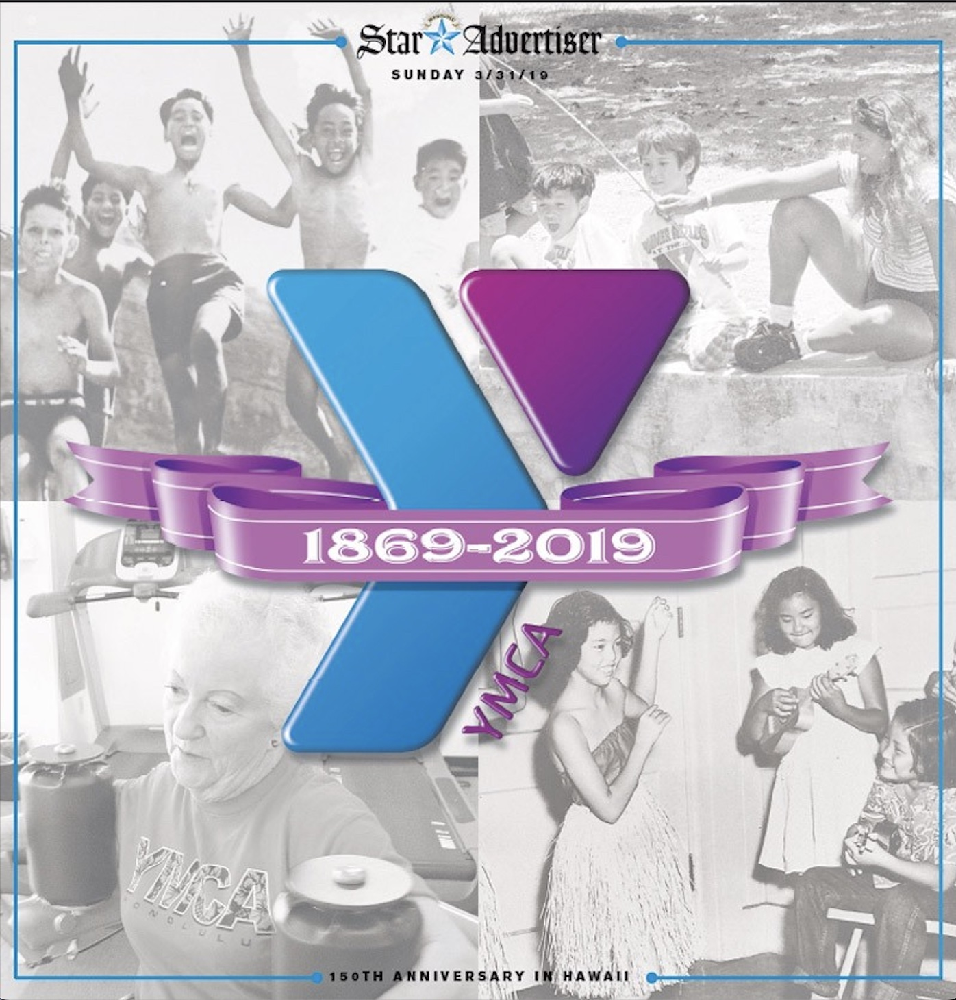

## Description:

## Contribution:

#### SignIn/SignUp Page

  
  
  
    

#### Footer 

#### Admin Page

- For more information on YMCA and its 150th anniversary, you can [click here](https://ymca150.ymcahonolulu.org/stories/18-nuuanu-YMCA).
* For more information on YMCA and its event, you can [click here](https://www.youtube.com/watch?v=GZHxqLYSsJ0).

