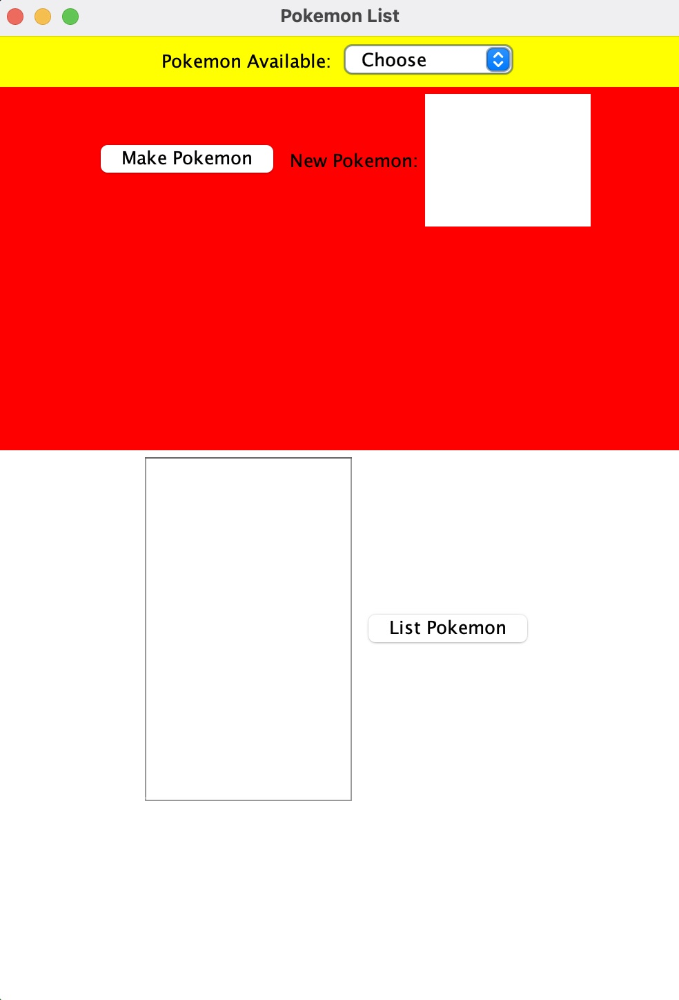
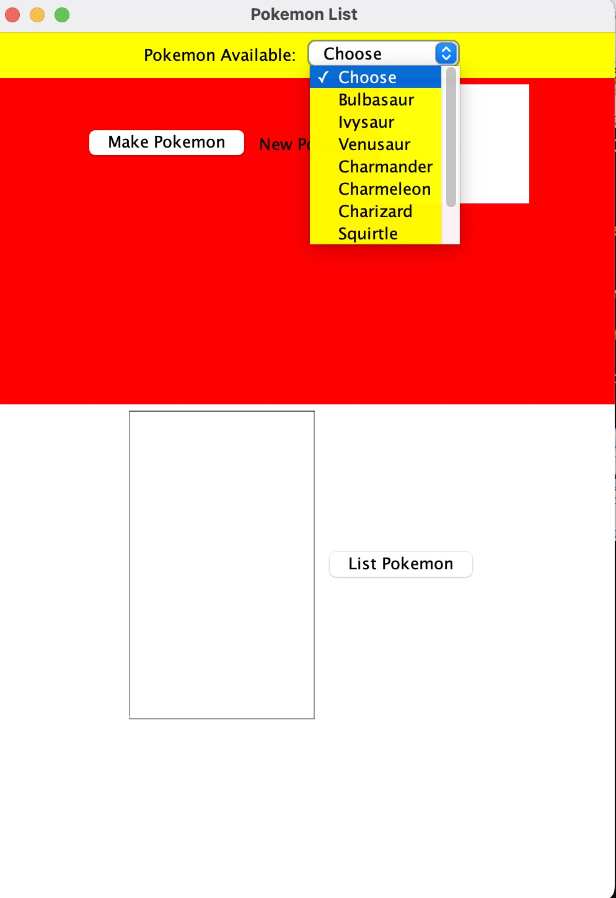
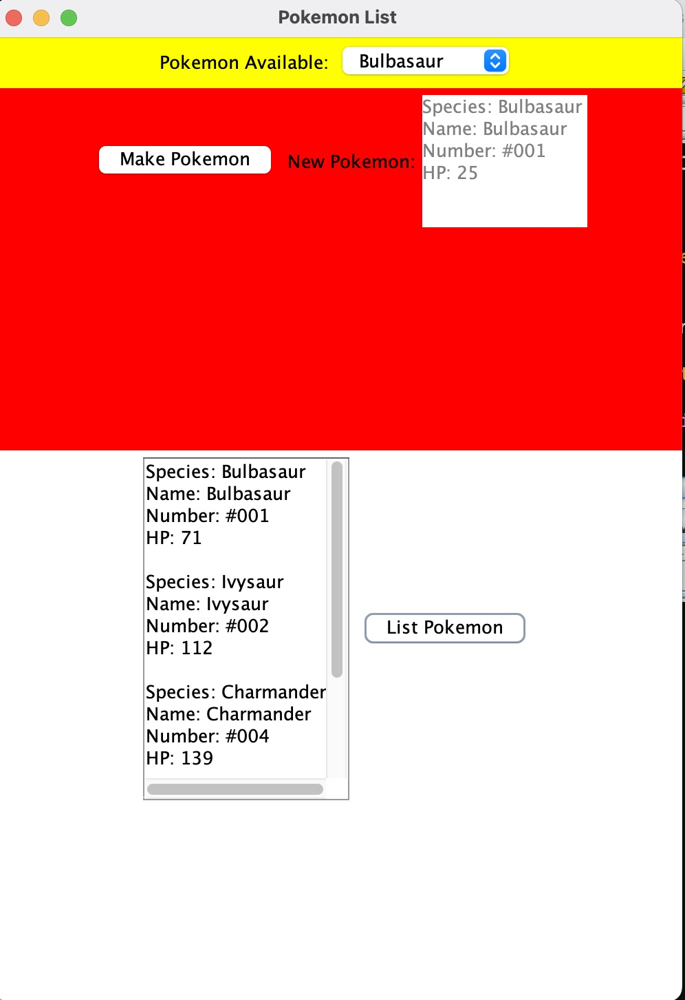

  
  
  

## Overview:
***
The code creates a small Pokemon GUI, allowing you to build and manage a list of your favorite Pokemon. There are seven different Pokemon to pick from. When you launch the software, it displays a drop-down menu with various Pokemon names. You can choose one, and the system will produce random health points for the selected Pokemon. Once you've generated a Pokemon, you'll see information like its name, identification number, and health points. There's also a function that allows you to see a list of all the Pokemon you've made so far, which makes it easier to manage your Pokemon collection.

## Thoughts:
***
This assignment was quite useful. It was my first time making a GUI, and it showed me a few things about frontend development. I witnessed how the placement of buttons and the colors used can make a major difference in how people use the program. It was a fantastic experience that has made me want to learn even more about this type of work. In the future, I envision expanding upon this project, transforming it into a larger, more comprehensive Pokemon management system.

