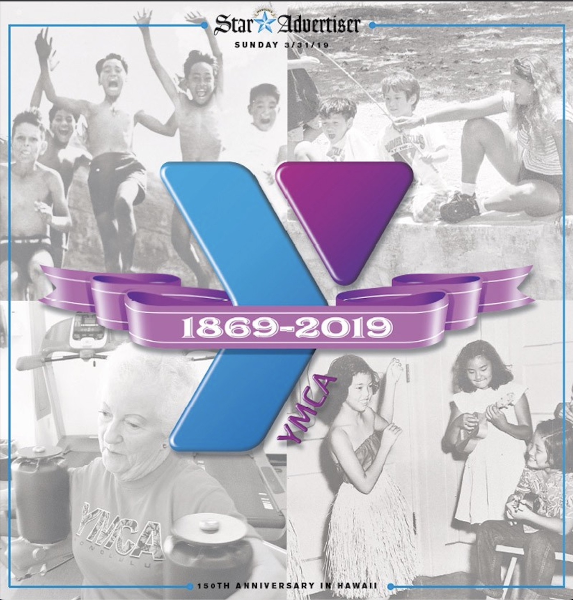

## History:
The Young Men's Christian Association, or YMCA, is an international organization that promotes healthy living, social responsibility, and youth development. Its rich history dates back to 1844, and its impact has been seen in local communities all around the world. To celebrate its 150th anniversary, our local YMCA decided to host a special event for the youth, reminiscent of a festive fair. I had the privilege of playing a key role in this event as a team leader.

## My Contribution:
As a team leader at YMCA, my responsibilities were multifaceted. Not only was I actively involved in volunteer work, but I also managed an after-school class. To commemorate the 150th anniversary, team leaders, including myself, were given the task to develop mini-games for the event. I designed a straightforward, yet engaging game: players had to knock off three bottles arranged in a triangular pattern using a ball.

On the event day, I was entrusted with several critical tasks. I helped set up games, arranged bounce houses, and served as a host for various games. We had devised a rotational system wherein the team leaders and staff switched roles every hour. These roles included serving as a game host, parking guide (ensuring efficient parking space allocation and directing visitors), sign holder (guiding visitors to the right locations), and taking rest breaks to rejuvenate.

## Learnings:
This experience was an invaluable lesson in teamwork, leadership, and event management. I learned the importance of being adaptable and responsive, especially when managing a large-scale event with many moving parts. The rotations ensured that each team leader developed a holistic understanding of the event operations, from visitor management to entertainment. The success of this event reinforced the importance of effective communication and collaboration among team members. It was an honor to contribute to such a historic milestone for the YMCA and to serve our community in this special way.

- For more information on YMCA and its 150th anniversary, you can [click here](https://ymca150.ymcahonolulu.org/stories/18-nuuanu-YMCA).
* For more information on YMCA and its event, you can [click here](https://www.youtube.com/watch?v=GZHxqLYSsJ0).

